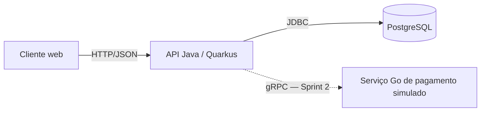

# Arquitetura do BomFilme

Este documento registra a arquitetura definida na Sprint 0. Ele separa o que já funciona na base do projeto das integrações previstas para as próximas sprints.

## Visão geral

A API Java é o serviço principal e a única responsável por persistir dados do domínio. O serviço Go terá uma responsabilidade isolada: simular o processamento de pagamentos. Ele não acessará diretamente o banco da aplicação e não confirmará compras por conta própria.

## Responsabilidades

| Componente | Responsabilidades |
| --- | --- |
| API Java/Quarkus | Regras do negócio, API REST, autenticação, catálogo, sessões, assentos, compras, ingressos, avaliações, persistência e migrações |
| PostgreSQL | Dados do domínio e garantia de restrições, incluindo a exclusividade de assentos por sessão |
| Serviço Go | Cenários reproduzíveis de aprovação, recusa, demora e falha de pagamento simulado |
| Contratos em `protos/` | Mensagens e operações gRPC versionadas entre Java e Go, a partir da Sprint 2 |

## Fluxo de compra previsto

1. A API cria a compra pendente e reserva o assento com uma operação segura no banco.
2. A API chama o serviço Go com prazo limite.
3. Uma aprovação confirma a compra e gera o ingresso.
4. Uma recusa libera a reserva e não gera ingresso confirmado.
5. Timeout ou falha de comunicação nunca confirma a compra automaticamente.

A política de expiração e recuperação das reservas será definida junto da implementação da compra na Sprint 2. Essa decisão evita registrar como pronta uma regra que ainda precisa de testes de concorrência e integração.

## Infraestrutura local

O `mise.toml` fixa Java 25 e Go 1.27.1 e fornece uma interface única para build, testes, lint, execução e CI. O `docker-compose.yml` cria uma rede isolada automaticamente e sobe PostgreSQL, API e a imagem do serviço Go. A API aguarda o banco ficar saudável; o serviço Go aguarda a API aceitar conexões.

As imagens usam build multiestágio. Maven e o compilador Go ficam apenas nos estágios de compilação. Os processos finais executam com usuários sem privilégios, sistema de arquivos somente leitura e permissão impedida de obter novos privilégios. Portas e credenciais locais podem ser alteradas pelas variáveis documentadas em `.env.example`; os valores padrão servem apenas ao desenvolvimento local.

## Verificações automatizadas

O comando `mise run ci` executa, em ordem:

1. validação Maven e `go vet`;
2. build Java e Go;
3. testes Java e Go.

O workflow `.github/workflows/ci.yml` executa esse mesmo comando em todo push e pull request. Assim, a verificação local e a verificação do GitHub usam as mesmas versões e tarefas.

## Evolução planejada

- Sprint 1: desenvolver as funcionalidades iniciais na API sem alterar os limites dos serviços.
- Sprint 2: definir os contratos em `protos/`, implementar o servidor gRPC em Go e testar os cenários de pagamento e concorrência.
- Sprint 3 e entrega final: incluir cache, observabilidade, publicação, segurança e documentação de operação conforme o backlog.
